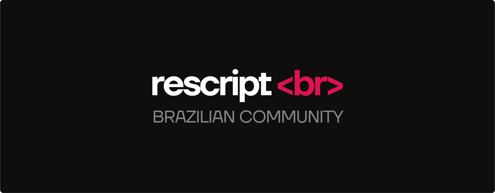

<h1 align="center"> Quer aprender ReScript? Comece aqui 🚀</h1>

 
 
 
 

    
  

 <a target="_blank" href="https://twitter.com/rescriptbr">Twitter</a> • 
 <a target="_blank" href="https://discord.com/invite/SSDMNYQ">Discord</a> 

 
 
 

## 📄 Sites & Docs Oficiais

- [Documentação ReScript](https://rescript-lang.org/)
- [Documentação ReScriptReact](https://rescript-lang.org/docs/react/latest/introduction)
- [Fórum Oficial ReScript](https://forum.rescript-lang.org/)
- [ReScript Association](https://rescript-association.org/)

## 📝 Cheat Sheets e Cookbooks

- [ReScript Bindings Cookbook - Vários exemplos de bindings](https://github.com/yawaramin/bucklescript-bindings-cookbook/blob/master/ReScript.md)

## 🎥 Videos

- [Rescript e React na prática](https://www.youtube.com/watch?v=pGA1RfNiGho)
- [ReScript: O ECMAScript 2077](https://www.youtube.com/watch?v=Hoed0aZGbJY)
- [Um servidor com ES77(ReScript](https://www.youtube.com/watch?v=_VfCjh31okk)
- [Playlist: Construindo uma aplicação utilizando ReScript e React](https://www.youtube.com/watch?v=hDratuXnfAo&list=PLr4c053wuXU_V-lMfFmDz9yWD5nw_lv_p)
- [O que é ReasonML/ReScript?](https://www.youtube.com/watch?v=tNgyRo2fhwU)
	- Talk sobre "O que é ReasonML/ReScript?", aborda tópicos básicos e faz introdução ao ecossistema ReScript.
- [ReScript Pomodoro Timer with React Hooks](https://www.youtube.com/watch?v=8ftCqZ2-7cQ)
	- Faz o uso de `useReducer` e algum `pattern matching` no processo.
- [Weather App in ReScript and React](https://www.youtube.com/watch?v=H6X6AJZna98)
	- Bom para ter um entendimento inicial de como fazer fetch em API's usando ReScript.
- [ReScript (ReasonML & BuckleScript), Next.js and Apollo Hooks blog](https://www.youtube.com/watch?v=ag4nUteMwkU&list=PLtDL321SUTJiC2BqrSUzoxozH138y4uhM&index=1)
	- Tutorial bem completo de uma integração de ReScript com Next, Apollo Hooks e AWS Appsync.
- [ReasonML Bootcamp: day one](https://www.youtube.com/watch?v=F2rfxtoZpB0)
	- Tutorial excelente no core da linguagem.
- [How to set up webpack for ReScript and React](https://www.youtube.com/watch?v=0CMmML7Q6Ds)
	- Setup inicial para usar ReScript com ReScriptReact.
- [ReScript (ReasonML) levado a sério](https://www.youtube.com/watch?v=8Qi_ZoXc2CI)

## 📝 Artigos

- [O que é e por que utilizar ReScript? Parte 1](https://blog.blumenaujs.org/o-que-e-e-por-que-utilizar-reasonml-parte-1)
 	- _Introdução sobre o que é ReasonML, seu ecossistema e os ambientes_
- [O que é e por que utilizar ReScript? Parte 2](https://blog.blumenaujs.org/o-que-e-e-por-que-utilizar-reasonml-parte-2)
	- _Artigo sobre porque você deveria adotar ReasonML ao invés de TypeScript ou Flow. Artigo completo sobre o básico de ReasonML, cobrindo tópicos como Pattern Matching, Variants, Funções e etc_

## 📚 Livros

- [Exploring ReasonML](http://reasonmlhub.com/exploring-reasonml/toc.html)
	_Livro muito completo sobre ReasonML, pode ser considerado um guia prático. Apesar de ser escrito utilizando a síntaxe "antiga" que é ReasonML, todo o conteúdo do livro é válido._
- [Type-Driven Development with ReasonML](https://www.amazon.com/Learn-Type-Driven-Development-applications/dp/1788838017)
	_O livro ensina como desenvolver software guiado a tipos com ReasonML. Aborda diversos detalhes interessantes sobre como a linguagem se comporta e como o sistema de tipos te guia a modelar seu software. Apesar de ser escrito utilizando a síntaxe "antiga" que é ReasonML, todo o conteúdo do livro é válido._

## 🤓 Pessoas

- Eduardo ([Twitter](https://twitter.com/TheEduardoRFS), [Twitch](https://twitch.tv/eduardorfs))
- Gabriel Abreu ([Twitter](https://twitter.com/fakenickels))
- Marcos "vmarcosp" ([Twitter](https://twitter.com/vmaarcosp), [GitHub](https://github.com/vmarcosp))
- Ciro ([Twitter](https://twitter.com/cironunesdev))
- Weslen ([Twitter](https://twitter.com/theweslenng), [GitHub](https://github.com/weslenng))
- André Lins ([Twitter](https://twitter.com/andrelmlins), [GitHub](https://github.com/andrelmlins))

## 🚀 Cursos

- [ES2077 by @fakenickels 🇧🇷](https://es77.fakenickels.dev/)
- [Learn ReasonML](https://learnreasonml.com/)
  _O curso utiliza a síntaxe ReasonML, mas serve como um guia para os iniciantes_
- [Get Started with ReasonML](https://egghead.io/courses/get-started-with-reason)
  _O curso utiliza a síntaxe ReasonML, mas serve como um guia para os iniciantes_

## 🚧 Projetos de exemplo

- [Blog Nextjs and Reason](https://github.com/enieber/blog)
- [FlashLink](https://github.com/andrelmlins/flashlink)
- [Get Shit Done](https://github.com/cironunes/gsd)
- [Pomodoro](https://github.com/tkovs/pomodoro)
- [Timerlab](https://github.com/vmarcosp/timerlab)

## 💡 Dúvidas frequentes? 
- **Qual a diferença entre ReasonML, BuckleScript e ReScript?**
 	> _[Leia mais sobre o rebranding entre ReasonML e ReScript](https://rescript-lang.org/blog/bucklescript-is-rebranding)_

-**Alguns conteúdos (artigos, vídeos, livros) utilizam a síntaxe ReasonML ao invés da síntaxe ReScript, devo usar a síntaxe ReasonML ou a síntaxe ReScript?**
	> _Anteriormente o compilador do ReScript (BuckleScript) utilizava a sintaxe ReasonML. Com o rebranding, o ReScript passou a ter sua própria sintaxe, no entanto a sintaxe ReasonML ainda é e será suportada por um bom tempo, mas o ideal é que você utilize a sintaxe ReScript em seus novos projetos e/ou migre os seus projetos para a nova sintaxe quando possível._
- **Onde estão os materiais relacionados a ReasonML e OCaml anteriormente listados aqui neste guia?**
	> Após o rebranding, esse guia foi atualizado e alterado para agrupar somente materiais relacionados a ReScript. Se você procura pela versão anterior com os conteúdos relacionados a OCaml/ReasonML você pode encontrá-los [aqui](https://gist.github.com/vmarcosp/72c782d8e36044ce8706127c443bd5fe).

## ❓Perguntas? 

Caso surja alguma dúvida sobre sintaxe, erros, bindings e etc [basta abrir uma issue](https://github.com/rescriptbr/comece-aqui/issues/new)

